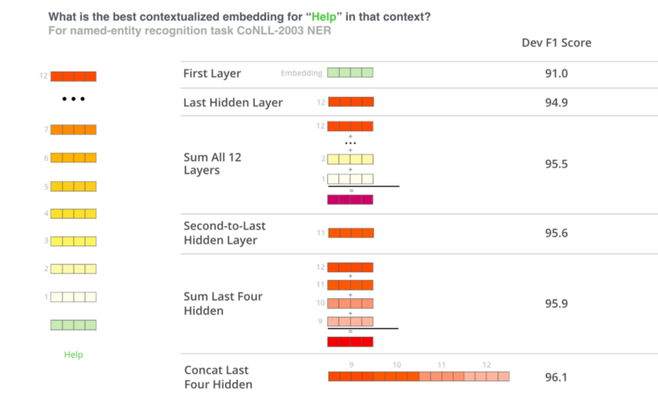

# Conversational_Text_Similarity_BERT

### Introduction

##### Objective

The goal of this project is to be able to predict relevant questions from natural language query/text.

##### Methods

There are various aproaches for semantic language similarity task. Common apporach is using embedding vectors of words, and them comparing high dimensional similarity between embedding vectors. Popular methods such as Word2Vec and Glove does a great job in representing words as vectors, however they are limited by the fact that words get a constant vector, irrespective of a context that words apear in. More modern approaches, specifically transformer-like methods such as Bert, GPT-2 or XLnet allows for flexible vectors depending on the context it apears on. Such models often come semi-ready for a lot of tasks, being pretrained on large corpuses. Nonetheless they are flexible to be fine-tuned for the task in hand by retraining/fine-tuning parameters using domain specific corpus. Approach taken in this project is to use BERT (base case uncased) fine tuned on domain corpus, which are conversational logs of clients seeking medical advice. 

Base-case uncased BERT model is trained on large wikipedia corpus and contains 110M parameters. There are other potentially promising pre-trained transformer models such as DeepPavlov/bert-base-cased-conversational, which are trained on conversational natural language texts, however testing those is beyond the scope of this project. Also there are significant number of ways text data could be prepared/engineered and vector similarity metrics. Some of them were explored here, however choices are abundant and user is free to expand, experiment further. It is important to note that embedding calculation uses sum from last 4 (out of 12) layers as suggested in research giving most accurate representation.

##### Results

BERT model had been fine-tuned using combined NSP/MLP methodology (https://huggingface.co/bert-base-uncased), on a tiny dummy corpus. Results and usefulness of the model seem ambigous, however framework, if used with more extensive dataset should provide more promsing results.  

### BERT fine tunning (section 2)

This is the main section for BERT model fine-tunning. Few different data augmentation strategies experimented with basic/default BERT hyperparemeters to establish benchmark model. 

##### Initial data prep

One of the necessary steps in data preparation for tunning is bert is to create subsequent/random sentence pairs (NSP head) in the from (sentence, subsequent sentence). Balanced data had been created with one random pair for every original pair. There are ways to improve by creating random pairs chosing sentences from different logs, however in the absense of training data random pairs had been created from the same log.

##### No data augmentation

In order to do intial tests no data augmentation was implemented. Default parameters was used. Negative combined (NLP + MLP) log likelihood loss was calculated on training data for each epoch which droped to 4.85 after 5 epochs.

##### Synonym insertion

In order to create first augmented dataset a synonym insertation was used based on NLTK (wordnet) package. (https://www.holisticseo.digital/python-seo/nltk/wordnet)  Stopwords had been removed, before changing 0.3 words with synonyms no less than 1 word and no more than 10. One augmented sentence created for every original sentence. Training loss dropped to 4.7 after 5 epochs with original parameters.

##### Back translation

Second augmented dataset was created by translating sentences to foreign language (german was used in this study), and then back. Module used - https://pypi.org/project/translators/. One augmented sentence created for every original sentence. Training loss dropped to 4.85 after 5 epochs with original parameters.

##### Back translation + synonym insertation

Two augmentation techniques combined to create an extended dataset (3x the original). Training loss dropped to 4.7 after 5 epochs with original parameters.

### BERT optimization via Bayes opt (section 3)

In order to find optimal hyperparameters Bayesian Optimization was chosen due to very expensive evaluation. This is the method to squeeze the last juice out of ML model, however should come after extensive experimentation with feature engineering and data gathering. Bayesian optimization based on - https://github.com/fmfn/BayesianOptimization. 

##### Prepare loss function

In order to evaluate model a common function from information retrieval theory had been chosen which is **top k precision**. Meaning the proportion of relevant documents (questions) in top k retrieved/predicted documents (questions). 

##### Prepare objective function

Objective function to be maximized (returning **top k precision**) had been created which takes optimizeable parameters **epochs, batch size, learning rate**. It is possible to expand objective function by adding customizeable data preparation techniques, however for the purpose of this project objective function maintained smaller, and best feature engineering type was chosen in previous section based on results on training data.

##### Optimize

Bayesian optmization engine initiaed with 3 random initializations of parameters (within provided range) and 15 expectation maximization iterations. **Best parameters : ... **.

### Train and save best model (section 4)

Use parameters inferred from previous section to train the best model. Best model along with tokenizer saved to local folder, together with question embeddings for quick access for a command line app. 

### Conclusions and discussion

There were few challenges faced. First of all, different aggregations of BERT hidden states had been experimented with involving different number of layers and different functions, however similar tendency observed of overly high and non-differentiating similarity scores between queries and questions, decreasing with increasing query length. (as more sentences withing query observed) Result could be severe undertraining with words triggering similar neurons. Also, there could be some unknown bug in embedding aggregation which need to be investigated. One more reason could be wrong method chosen, it is likely that framing problem to have a classification head (multilabelled data for training aka tag problem) would improve embedding accuracy. It is likely that for the method to be used for production with low latency, bi-directional transformer should be trained from scratch.
